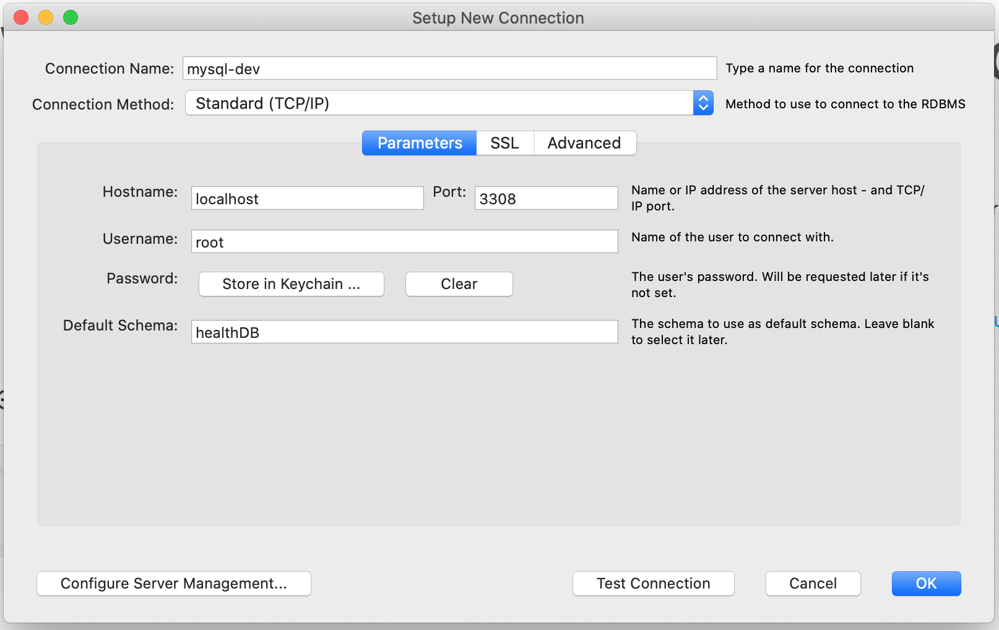

# Health Journal - MySQL DB

This project contains the MySQL Server needed for the Health Journal App Database. DB runs on port `3308`.

## Setup

### Environment Variables

- Create a `.env` file containing

```bash
MYSQL_ROOT_PASSWORD=<PASSWORD HERE>
```

### Starting Server

- `docker-compose up`

### MySQL Workbench



### Shutting Down Server

- `docker-compose down`
